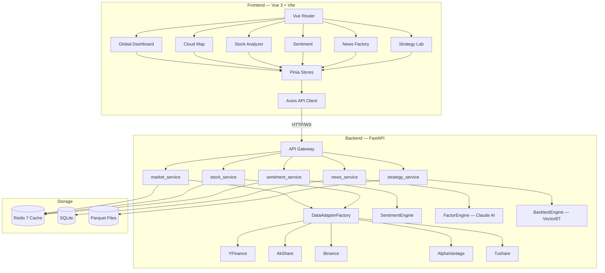

# 🏗️ KunLun Terminal Pro — Architecture Specification

> **Version**: 2.0.0 | **Last Updated**: 2026-04-23

---

## 1. Design Philosophy

### 1.1 "Anti-Brain-Fog" Modularity
每个功能都是一个独立的、可单独开发和测试的模块。前端的 `modules/` 和后端的 `api/ + services/` 严格一一对应。开发某个模块时，不需要理解其他模块的实现。

### 1.2 Layered Architecture
后端采用经典三层架构，职责清晰分离：

```
API Routes (路由层)     → 参数验证、响应格式
   ↓
Services (业务层)       → 编排逻辑、缓存策略
   ↓
Engines / Adapters      → 纯计算 / 外部数据源
```

### 1.3 Data Adapter Pattern
所有外部数据源通过统一接口 `BaseDataAdapter` 接入。`DataAdapterFactory` 负责按市场类型自动路由到最优适配器，并在主源故障时自动降级。

---

## 2. System Architecture



---

## 3. Module × Layer Matrix

每个前端模块都有对应的后端 API / Service / Engine 链路：

| 前端模块 | 后端 API | Service | Engine | 数据源 |
| :--- | :--- | :--- | :--- | :--- |
| `global-dashboard` | `market.py` | `market_service` | — | YFinance, AkShare |
| `global-dashboard/CloudMap` | `market.py` (cloudmap) | `market_service` | — | AkShare, Tushare |
| `stock-analyzer` | `stock.py` | `stock_service` | — | YFinance, AkShare |
| `sentiment` | `sentiment.py` | `sentiment_service` | `SentimentEngine` | YFinance |
| `news-factory` | `news.py` | `news_service` | `FactorEngine` | Scrapers + Claude |
| `strategy-lab` | `strategy.py` | `strategy_service` | `BacktestEngine` | Parquet + VectorBT |

---

## 4. Data Flow & Caching

### 4.1 Cache-Through Pattern
```
Frontend Request
    → FastAPI Route
        → Service checks Redis (key = "market:{ticker}:{interval}")
            → HIT:  return cached JSON
            → MISS: call DataAdapterFactory.get_best(market)
                       → Adapter fetches external data
                       → Service writes to Redis with TTL
                       → return fresh JSON
```

### 4.2 TTL Policy

| 数据类型 | Redis Key Pattern | TTL | 说明 |
| :--- | :--- | :--- | :--- |
| 实时行情 | `tick:{ticker}` | 5s | WebSocket 推送优先 |
| 1分钟 K 线 | `kline:1m:{ticker}` | 60s | |
| 日 K 线 | `kline:1d:{ticker}` | 3600s | |
| 新闻流 | `news:latest` | 300s | AI 分析结果缓存更久 |
| 云图数据 | `cloudmap:{market}` | 60s | 按市场独立缓存 |

### 4.3 Adapter Failover
```
Primary (YFinance) → Timeout/Error
    → Factory selects Secondary (AkShare)
        → Still fails
            → Return cached data (stale but available)
                → If no cache, raise DataSourceError(503)
```

---

## 5. UI/UX Design System

### 5.1 Color Tokens
```css
--kl-bg:      #0D1117    /* 深空背景 */
--kl-surface: #161B22    /* 卡片/面板 */
--kl-border:  #30363D    /* 边框 */
--kl-cyan:    #00F5FF    /* 主色调 */
--kl-magenta: #FF00FF    /* 辅助色 */
--kl-up:      #EF4444    /* 红涨 ★ */
--kl-down:    #22C55E    /* 绿跌 ★ */
```

### 5.2 Typography
- **数据展示**: JetBrains Mono (等宽, tabular-nums)
- **界面文本**: Inter (无衬线)
- **所有数字**: 使用 `.mono-num` class 强制等宽对齐

### 5.3 Glassmorphism
```css
.glass-panel {
  background: rgba(22, 27, 34, 0.7);
  backdrop-filter: blur(20px);
  border: 1px solid #30363D;
  border-radius: 12px;
}
```

---

## 6. Development Workflow

### 6.1 Phase-Based Iteration
每个 Phase 完成后提交一个 Git Tag：
- `v0.1.0` — Phase 1: Core + Dashboard + CloudMap
- `v0.2.0` — Phase 2: Analyzer + Sentiment
- `v0.3.0` — Phase 3: News AI + Strategy Lab

### 6.2 Code Standards
- **Python**: PEP 8 + type hints on all functions
- **TypeScript**: strict mode + ESLint
- **Commits**: Conventional Commits (`feat:`, `fix:`, `docs:`)

### 6.3 Testing Strategy
- **Backend**: pytest + FastAPI TestClient (smoke tests → unit → integration)
- **Frontend**: Vitest + Vue Test Utils (component tests)
